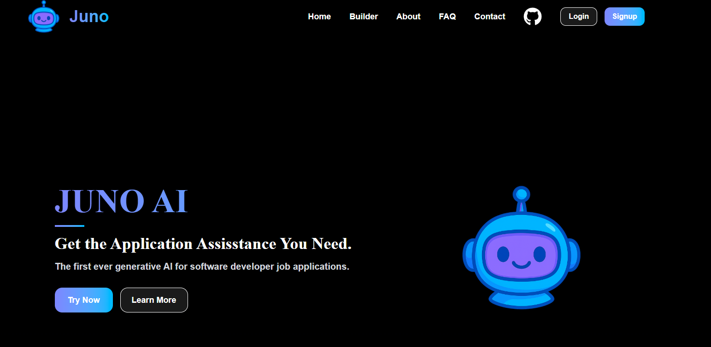
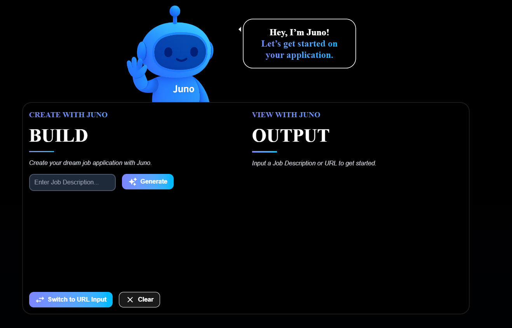
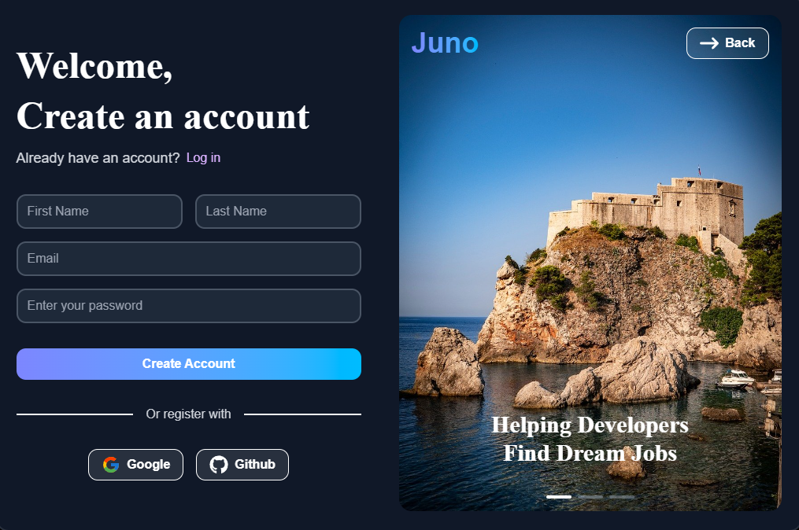
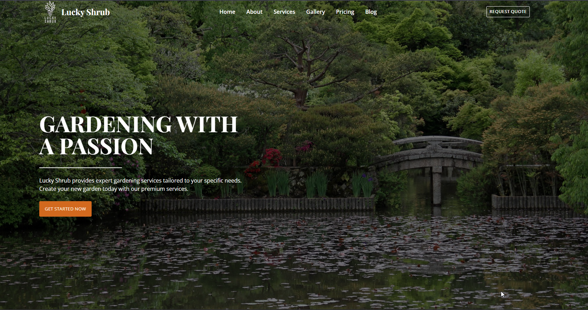
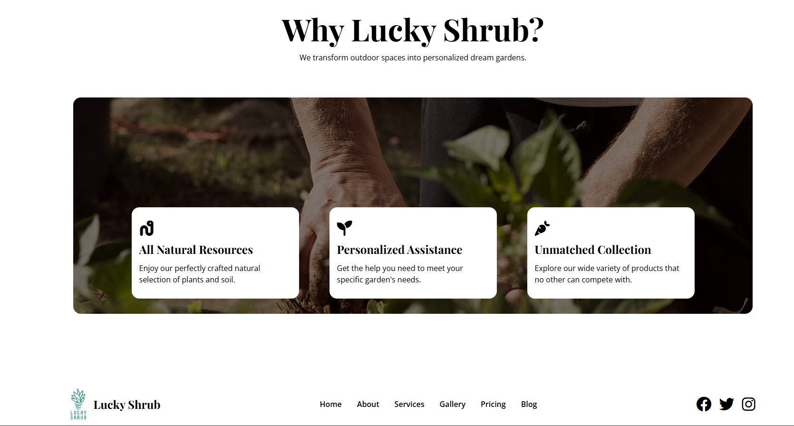
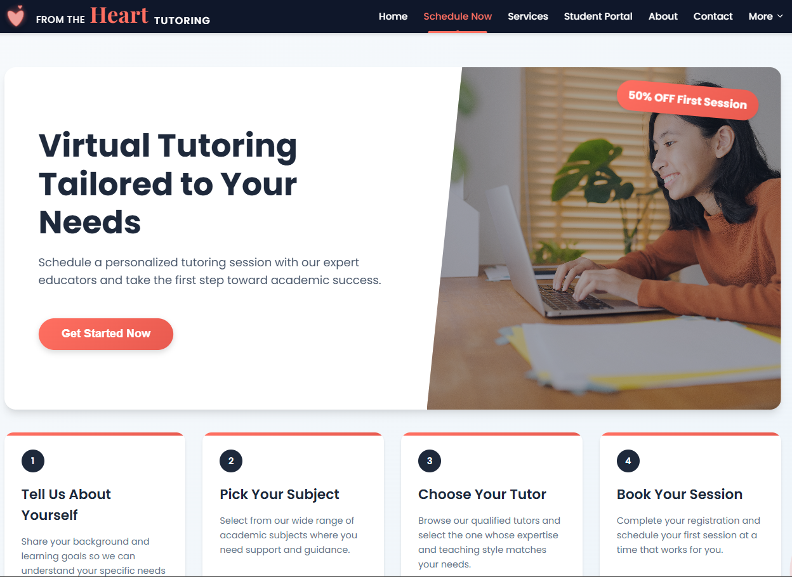
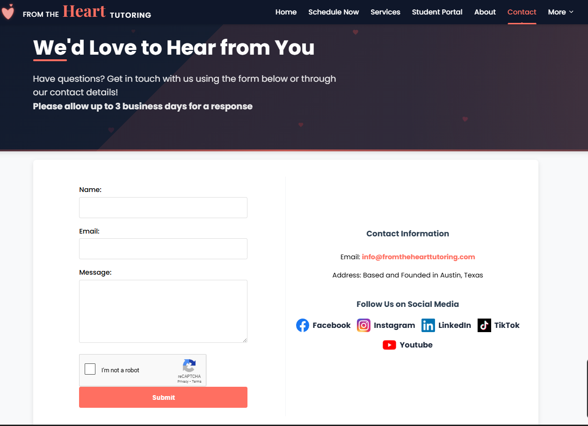

  

<h1 align="center">Hello! I'm Evan Varan</h1>
<h3 align="center">A Full‑Stack Developer & Electrical Engineer</h3>

  

  

  

---

## &nbsp;Favorite Technologies

**Languages:**  

**Frameworks & Tools:**  

&nbsp;

## &nbsp;Current Projects

-  [Meta-Frontend-Developement-Course](https://github.com/Evan-Varan/Meta-Frontend-Developement-Course) – Currently Learning Frontend Development through Meta!
-  [Juno-Application-Assistant](https://github.com/Evan-Varan/Juno-Application-Assistant) – A full-stack project to help software developers with job applications. Made with React, Tailwind CSS, SQL, and C#.  
-  [From-The-Heart-Tutoring](https://github.com/Evan-Varan/FTHT-Website-V2) – My Full-Stack redesign of my website. Made with React, Tailwind CSS, SQL, and C#. Original website made with JS, HTML, and CSS.

&nbsp;

## &nbsp;Recent Portfolio Project

## &nbsp;Stats & Activity

  

  

&nbsp;

  

